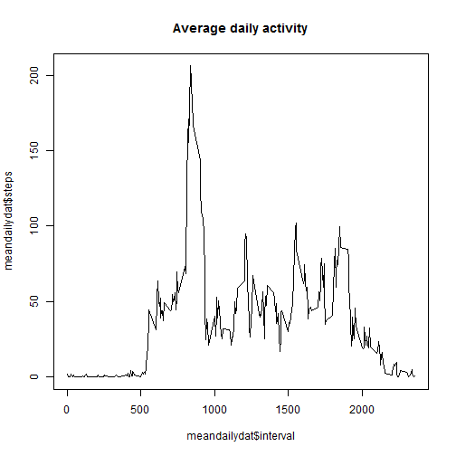
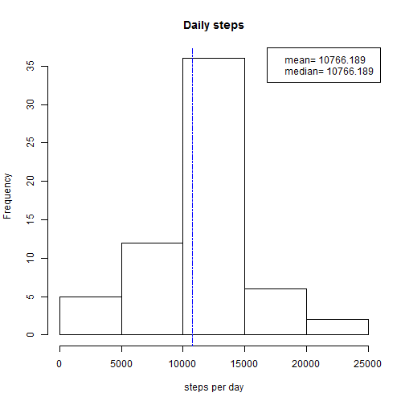

##Introduction

[This markdown file contains the work submitted for the coursera reproducibe research course assignment 1 details can be found here.](https://class.coursera.org/repdata-033/human_grading/view/courses/975146/assessments/3)

To summarise the assignment is to take data from a personal activity device. This device collects data at 5 minute intervals through out the day. The data consists of two months of data from an anonymous individual collected during the months of October and November, 2012 and include the number of steps taken in 5 minute intervals each day. The student has to perform some simple analysis on this data and submit that analysis using Rmarkdown in a manner consistent with **Literate/Statistical Programming**

####The dataset
The variables included in this dataset are:
-steps: Number of steps in a 5-minute interval
--(missing values are coded as NA)
-date: The date on which the measurement was taken in YYYY-MM-DD format
-interval: Identifier for the 5-minute interval in which measurement was taken

[The data was downloaded from here](https://d396qusza40orc.cloudfront.net/repdata%2Fdata%2Factivity.zip)


```r
dataset<-read.csv('activity.csv')
```

                              ========================
                                 ==================
      
#### Question 1. What is mean total number of steps taken per day?
Note: **ignore the missing values in the dataset.**


First the **aggegrate()** function was used to perform and aggegrated sum of daily steps on the raw dataframe **dataset{}**. The results are stored in the data.frame **dailystepsum{}**. Here NA's are not ignored in that summation.  


```r
#calculate the total steps per day NA's ar eignored using na.omit
dailystepsum <- aggregate(steps~date, dataset,sum,na.action=na.omit)
```

Next the mean and median steps across all days are calculated


```r
#calculate the mean ignoring NA's
mestep<-signif(mean(dailystepsum$step), digits = 8)
#calculate the median ignoring NA's
mistep<-signif(median(dailystepsum$step), digits = 8)
```

A histogram of the total steps per day is plotted, because the **mean=**1.0766189 &times; 10<sup>4</sup> and **median=**1.0765 &times; 10<sup>4</sup> are close together, It is not possible to see the difference between them on the plot using the **Abline()** function, So the legend is used to report the actual values on the plot.


```r
#Plot a histogram of the daily data
hist(dailystepsum$steps,main = "Daily steps",xlab = "steps per day")

#present the mean and median in the legend box
legtext<-c(paste("mean=",as.character(mestep),""),
           paste("median=",as.character(mistep),""))
legend("topright",legtext)
abline(v =mestep, col="RED", lty = 3)
abline(v =mistep, col="BLUE", lty = 6)
```

 

                              ========================
                                 ==================
      
#### Question 2 What is the average daily activity pattern?
####    2.1  Make a time series plot  5-minute interval and the average number of           steps taken across all days
####    2.2	Which 5-minute interval contains the maximum number of steps?

The **aggerate()** function is used to calculate the mean number of steps per interval across all days and stored in the data frame **meandailydat{}** .This data is plotted using plot to show mean activity dataset. 


```r
#Generate the mean step dataframe across all days
meandailydat <- aggregate(steps~interval, dataset,mean)

# Plot this dataset
plot(meandailydat$interval,meandailydat$steps,type="l",main="Average daily activity")
```

 

```r
#find the index of the maximum value`
maxindx<-which.max(meandailydat$step)
maxstep<-meandailydat$step[maxindx]
#use this index to pring the interval in which it occurs
fiveminmax<-meandailydat$interval[maxindx]
```

                         
Using the **which.max()** function the **maxmimum value=**835 it occurs at **interval=**104

                              ========================
                                 ==================
                         
####Question 3 Calculate and report the total number of missing values in the dataset 
####    3.1 Devise an imputation strategy to substitute all missing values in the raw dataset
####    3.2 how does the imputation effect the mean and median values calculated for the orignal datsset in question 1 

The **is.na()** function is used to calculate the number of NA in the raw **dataset{}**

```r
#use is.na() --> number of NA in the raw dataset
numnas<-sum(is.na(dataset$steps))
```
The total number of missing values are `r numnas'.
 
#####The following Imputation stragety was used
The **meandailydata{}** dataframe(mean number of steps per interval across 2 months)
generated in question 2 above, contains the mean dataset over all days, As such its interval values are a good proxy for missing values. The strategy is to replace any missing values (NA's) in raw **dataset{}** with the appropriate **meandailydata{}** value.The results are stored in the new dataframe **imputeddataset{}**.


```r
#if a NA's is present at a given interval find the corresponding value from
#the meandailydat{} dataframe and substituded in its place

    for(i in 1:nrow(dataset)) {    
        if (is.na(dataset[i,1])) {        
          imputeinterval<-dataset[i,3]#if NA tag interval
          #find corresponding index for daily average data frame
          imputeindex<-match(imputeinterval,meandailydat$interval)
          #replace NA with corresponding average for thatinterval 
          dataset[i,1]<-imputevalue<-meandailydat$steps[imputeindex]
        }             
    }

#Create a new dataset that is equal to the original dataset
#but with the missing data filled in.
imputeddataset<-dataset
```

To examine the effect of the imputation the analysis in question 1 is repeated on the imputed dataset **imputeddataset{}**


```r
#Recalculate the total steps per day with imputed dataset
dailystepsum <- aggregate(steps~date, imputeddataset,sum)

#calculate the mean ignoring NA's
mestep<-signif(mean(dailystepsum$step), digits = 8)
#calculate the median ignoring NA's
mistep<-signif(median(dailystepsum$step), digits = 8)

#Plot a histogram of the daily data
     hist(dailystepsum$steps,main = "Daily steps",xlab = "steps per day")
     
     #present the mean and median in the legend box
     legtext<-c(paste("mean=",as.character(mestep),""),
                paste("median=",as.character(mistep),""))
     legend("topright",legtext)
     abline(v =mestep, col="RED", lty = 3)
     abline(v =mistep, col="BLUE", lty = 6)
```

 

```r
#dev.off()
```

It can be seen that the **mean=**1.0766189 &times; 10<sup>4</sup> and **median=**1.0766189 &times; 10<sup>4</sup> are now changed.Now the median and mean are the same the implication is this in now a perfectly symmetrical data set, the small change implies the NA had very little effect on the original dataset. 

                              ========================
                                 ==================
      
#### Question 4 Examine the diffrence between the activity on weekends and week days using # the imputed dataset

To do this the **asWdays()** function was used to create a new data set **withweekdays{}** which has an additional factor "day" tagging the day name to the date, then by subsetting on this factor two new data sets **weekday{}** and **weekend{}** are generated using the **arrange()** function from the dplyr package. 


```r
#load dplyr but do not display output
library(dplyr)
```

```
## 
## Attaching package: 'dplyr'
## 
## The following object is masked from 'package:stats':
## 
##     filter
## 
## The following objects are masked from 'package:base':
## 
##     intersect, setdiff, setequal, union
```


```r
#Calculate the corresponding days for the measurement dates
dates<-factor(dataset[,2])
asWdays<-weekdays(as.Date(dates))

#Create a new dataframe with  weekdays included
withweekdays<-data.frame(dates=dates, day=asWdays, 
                         steps=dataset[,1], interval=dataset[,3] )

#Sort by day and create two dataframes 1 for weekdays and one for the weekend
mon<- subset(withweekdays, day == "Monday")
tue<- subset(withweekdays, day == "Tuesday")
wed<- subset(withweekdays, day == "Wednesday")
thu<- subset(withweekdays, day == "Thursday")
fri<- subset(withweekdays, day == "Friday")
sat<- subset(withweekdays, day == "Saturday")
sun<- subset(withweekdays, day == "Sunday")
weekday<-rbind(mon,tue,wed,thu,fri)
weekend<-rbind(sat,sun)


#Rearrange by date using dplyr function arrange() 
weekday<-arrange(weekday, dates)
weekend<-arrange(weekend, dates)

# calculate the typical mean weekday and weekend day 
meanweekday <- aggregate(steps~interval, weekday,mean)
meanweekend <- aggregate(steps~interval, weekend,mean)
```

Now by plotting these two data frames, **meanweekend{}**, **meanweekday{}** the difference between them can be clearly seen. The activity during the weekdays peaks in the morning around 7-9am (morning exercize or travel to work?) and remains relatively low through the rest of the day with a smaller peak in the evening. Conversely the weekend has activity is low in the morning and reaches a plateua where it remanis until the late evening.


```r
#Build a plot comparing the weekend and weekday dataframes
par(mfrow = c(2, 1), mar = c(2, 2, 1, 1), oma = c(0, 0, 2, 0))
  plot(meanweekday$steps,meanweekday$Interval, main = "Average weekday",type="l")
  plot(meanweekend$steps,meanweekend$Interval, main = "Average weekend",type="l")
  mtext("Number of steps weekdays Vs weekend", outer = TRUE)
```

 

                              ========================
                                 ==================
      
